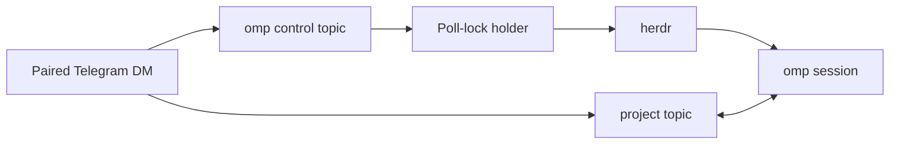

# Complete guide

[Back to the quick start](../README.md)

Run a Telegram bot **inside** an omp coding session. Incoming DMs and configured
group @-mentions are injected as user messages; assistant replies stream back to
Telegram in real time. One paired DM owner controls the bridge; optional group
chat access remains separately configured from the terminal, never by the model.

- **Inbound:** DMs / group mentions → injected as `<telegram-message …>` user turns (photos attached inline; other files downloaded to an inbox).
- **Outbound:** assistant output streams live — native message **drafts** for DMs (Bot API 9.3+), **edited-message** previews for groups — then one finalized MarkdownV2 message per turn.
- **Control:** local `/telegram` configuration, owner-only Telegram commands (`/spawn`, `/sessions`, `/stop`, `/status`), and two model tools (`telegram_send`, `telegram_react`).
- **Zero runtime dependencies** — the raw Bot API over Bun's `fetch`/`FormData`.

## How it fits together



One omp process holds the Telegram poll lock. Global bridge commands are handled
centrally in **omp control**; messages in project topics are routed to their
owning omp processes.

## Requirements

- omp ≥ 16.3.12, Bun ≥ 1.3
- A Telegram bot token from [@BotFather](https://t.me/BotFather)
- [herdr](https://herdr.dev/) for `/spawn` and `/sessions` (chat bridging works without it)

## Install

Clone the repository, then link it into omp:

```bash
git clone https://github.com/TerrifiedBug/omp-telegram.git
cd omp-telegram
omp plugin link .
omp plugin list        # → omp-telegram@0.1.0
```

`omp plugin link` needs no build or install step: the extension has zero runtime
dependencies and uses only the raw Bot API and Node/Bun built-ins. `bun install`
is needed only for development checks.

## Create a bot

1. Message [@BotFather](https://t.me/BotFather) and send `/newbot`.
2. Choose a name and a username ending in `bot`.
3. Copy the token it gives you (`123456789:AAH…`).
4. Recommended: `/setprivacy` → select your bot → **Disable** if you want the bot
   to read all group messages (only needed for `--no-mention` groups; see below).

## Configure

Inside an omp session:

```
/telegram token 123456789:AAH...      # validates via getMe, stores ~/.omp/agent/telegram/.env (0600)
/telegram on                          # start polling now, and autostart in future sessions
```

`/telegram token` reports `@yourbot ok` on success. `/telegram on` sets
`access.enabled = true` so the bridge autostarts every session.

## Activation

The bridge starts when **any** of these is true at session start:

| Method | Scope |
|---|---|
| `omp --telegram` | this session only |
| `OMP_TELEGRAM=1` env | this session only |
| `/telegram on` (sets `enabled`) | every session, until `/telegram off` |

If no token is configured it stays passive and warns once (`no bot token`).

## Pairing

Default DM policy is **pairing**, with exactly one operator:

1. The prospective owner DMs the bot anything → the bot replies with a 6-character code.
2. You run `/telegram pair <code>` in omp → the bot confirms the owner in their DM.
3. From then on that owner's DM reaches omp and gains the private control commands.

Once an owner is paired, other DMs are silently dropped and cannot mint pairing
codes. Transfer ownership locally with `remove <owner-id>`, then pair the replacement.
Codes expire after 1 hour; at most 3 are pending before an owner is established.

## `/telegram` command reference

| Subcommand | Effect |
|---|---|
| `/telegram` or `status` | Running state, bot username, policy, owner, pending codes, groups, config, lock holder |
| `token <bot-token>` | Validate (`getMe`) then store the token; run `on` to start |
| `on` / `off` | Start / stop polling now; persists `enabled` |
| `pair <code>` | Approve a pending pairing; the bot confirms in-chat |
| `deny <code>` | Drop a pending code |
| `allow <user-id>` / `remove <user-id>` | Set or remove the sole DM owner; a second owner is refused |
| `policy <pairing\|allowlist\|disabled>` | Set DM handling |
| `group add <id> [--no-mention] [--allow a,b]` | Allow a group; optionally drop the mention requirement / restrict senders |
| `group rm <id>` | Remove a group |
| `set <key> <value>` | Tune delivery/UX (see below) |
| `notify <chat_id>` / `notify off` | Ping a chat when a **locally-started** run goes idle (AFK pings). Off by default. |
| `topics on` / `topics <chat_id>` / `topics off` | Per-session **forum topics**: claim one topic per omp session, routing each session's traffic to its own thread. `on` auto-hosts in your paired DM (no id needed); `<chat_id>` hosts in a specific chat (e.g. a forum supergroup). Off by default. |

Every mutation persists to `access.json` and takes effect on the next inbound
message (the poller re-reads access per message).

## Telegram command reference

These commands are accepted only in the paired owner's private DM. Known bot
commands typed in a group are consumed and never become omp user turns.

With owner-DM topics enabled, the bridge creates one persistent **omp control**
topic. Use it for `/spawn`, `/sessions`, `/status`, `/help`, and `/whoami`; use
session topics for agent conversations and session-local `/stop`, `/compact`,
`/model`, `/switch`, and `/thinking` commands. A global command entered elsewhere
posts its result in omp control and leaves a short redirect notice in the
originating topic.

| Command | Effect |
|---|---|
| `/spawn [space]` | List open herdr spaces with inline buttons, or confirm an exact label. A space with live omp sessions requires confirmation before starting another. |
| `/sessions` | Compare live herdr omp processes with live, unattached, outside-herdr, and stale Telegram topic claims. |
| `/stop` | Abort the current task. Run it inside the omp topic to identify the owning session. |
| `/compact [focus]` | Compact the owning session's context while it is idle. Optional text focuses the summary. |
| `/model [provider/id]` | Show a paged model picker, or switch directly to an authenticated model specification. |
| `/switch` | Alias for the `/model` picker. |
| `/thinking [level]` | Show a thinking-level picker, or set `inherit`, `off`, `minimal`, `low`, `medium`, `high`, or `xhigh`. |
| `/status` | Show the paired owner, bridge state, topics state, live omp count, and topic-owner count. |
| `/help` | Show the owner command summary. |
| `/whoami` | Show Telegram chat and user IDs. |

`/spawn` uses Telegram's native inline keyboard, not a Mini App. The poll-lock
holder revalidates the short-lived selection, creates an unfocused herdr tab,
and runs `omp` in its root pane. The new omp process loads this extension and
claims its topic. Repeated or expired callback actions cannot spawn twice.

When the paired owner sends a normal message to a stale owner-DM topic, the
poll-lock holder queues the message, revalidates the topic's saved herdr space,
and starts `omp --resume` with the exact saved session file. The resumed process
reclaims that same topic and consumes the queue. Concurrent messages queue
without starting duplicate processes. `/stop` never starts an idle session, and
configured groups never receive process-spawning authority.

### `set` keys

| Key | Values | Default |
|---|---|---|
| `streaming` | `true` \| `false` | `true` |
| `deliverAs` | `steer` \| `followUp` — how inbound queues while the agent is busy | `followUp` |
| `chunkMode` | `length` \| `newline` | `newline` |
| `textChunkLimit` | `1`–`4096` | `4096` |
| `replyToMode` | `off` \| `first` \| `all` — threading for `telegram_send` replies | `first` |
| `ackReaction` | a whitelist emoji (empty to disable) — reaction on receipt | unset |
| `mentionPatterns` | JSON array of regexes that also satisfy group mention-gating, e.g. `["\\bassistant\\b"]` | unset |

## Groups

```
/telegram group add -1001234567890                    # mention-gated (default)
/telegram group add -1001234567890 --no-mention       # respond to every message
/telegram group add -1001234567890 --allow 111,222    # only these user IDs
```

> **Only configure trusted groups and trusted sender IDs.** A permitted group
> message is a normal omp user prompt with the session's workspace and tool
> access: it may read files, run commands, or modify code. Mention gating prevents
> accidental activation; it does not make an untrusted sender safe. Prefer
> `--allow <user-ids>`, and never use `--no-mention` in a public or untrusted group.

Find a group's ID: add the bot, send a message, then check
`~/.omp/logs/omp.$(date +%F).log` for `ignored message from unconfigured group <id>`.
`--no-mention` also requires BotFather `/setprivacy` → **Disable** so the bot
actually receives non-mention messages. In mention-gated groups, an `@botname`
mention, a reply to one of the bot's messages, or a `mentionPatterns` match all
count as a mention.

## Model tools

- **`telegram_send`** — send text and/or files to the active chat (or a given
  `chat_id`). Text is chunked and rendered as MarkdownV2 (plain-text fallback on
  parse errors). `files` are absolute paths: images send as photos, everything
  else as documents (≤ 50 MB each).
- **`telegram_react`** — react to a message with a Telegram whitelist emoji
  (👍 👎 ❤ 🔥 👀 🎉 …).
- **`telegram_ask`** — during a Telegram-originated turn, ask the originating
  user one or more single-select, multi-select, or free-text **Other** questions
  with inline keyboards. Requests are responder-, chat-, topic-, message-, nonce-,
  and expiry-bound; cross-process answers use the shared state directory.

`telegram_send` and `telegram_react` refuse any chat the inbound gate would not
deliver from. `telegram_ask` responds only to the exact user who originated the turn.

## State directory

`~/.omp/agent/telegram/` (override with `OMP_TELEGRAM_STATE_DIR`, mode 0700):

| Path | Purpose |
|---|---|
| `.env` | `TELEGRAM_BOT_TOKEN=…` (0600; the real process env wins over this file) |
| `access.json` | Access + config state (atomic writes) |
| `inbox/` | Downloaded attachments; each file is ≤ 20 MiB, and startup/download cleanup removes files older than 7 days then prunes oldest files above 250 MiB total |
| `prompts/` | Expiring cross-process selectable-question requests and answers |
| `bot.lock` | Poller PID lock |
| `threads.json` | Topic registry — which session (pid/cwd) owns which forum topic |
| `route/<thread_id>/` | Cross-process routed-message spool (topics mode) |

## Streaming behavior

- **DMs** use native message drafts (`sendMessageDraft`): a live "typing" bubble
  that updates as the model generates. If the running Bot API lacks drafts, the
  bridge latches to the edit path automatically.
- **Groups** (and draft-unsupported DMs) send a preview message and edit it in
  place with a `▍` cursor, throttled and split when it would exceed 4096 chars.
- Each assistant **turn** finalizes into its own real Telegram message, so a
  multi-step run reads as a sequence of messages. `set streaming false` skips the
  live preview and sends only the finalized message per turn.

## AFK notifications

By default the bridge is reactive — it only messages a chat that messaged it
first, and a **locally-started** run (one you kick off at the terminal) mirrors
nothing. `/telegram notify <chat_id>` opts one chat into an idle ping: when a
locally-started run finishes and the session goes idle, the bot sends a short
`✅ omp idle in <dir> — your turn.` to that chat. Arm it before you step away,
`/telegram notify off` when you're back; grab your `<chat_id>` from `/whoami` in
the bot DM.

- Only **locally-started** runs ping — Telegram-initiated runs already stream
  their reply back, so they never double-notify.
- The target is a single chat you set at the terminal, never "the last active
  chat", so a ping can't leak to whoever DMed the bot most recently.
- Sending doesn't need the poll lock, so in a multi-session setup any session
  with the token configured pings on its own idle — including the `<dir>` so you
  can tell which one finished.
- Requires the bridge to be running — arming while it's off warns you, and pings
  only start once you run `/telegram on`.

## Per-session topics

When several omp sessions share one bot, a single chat can't tell them apart: the
poll-lock holder receives every message and its replies land in the chat's main
view, so you can't address a specific session. **Topics mode** gives each session
its own Telegram **forum topic**, named after its project directory, inside one
operator-chosen chat.

```
/telegram topics on           # topics on, auto-hosted in your paired DM; claim this session's topic
/telegram topics -1001234567890 # topics on, hosted in a forum supergroup
/telegram topics off          # release this session's topic and turn topics off
/telegram topics              # show the topics chat, this session's topic, and DM forum-topic mode
```

- Each session **claims one topic** on start (and when that session runs `/telegram topics on` or `/telegram topics <chat_id>`),
  named after `basename(cwd)`. A session restarted in the same directory **re-adopts**
  its existing topic instead of creating a duplicate; a second live session in the same
  directory gets a `<name>-<pid>` topic. Sessions already running when topics are first
  enabled must reload or restart before they claim one.
- A message typed **inside a topic** is routed to the session that owns it — even a
  different omp process — and that session's replies, streaming previews, and typing
  indicator all land **inside that topic**. Cross-process delivery goes through the
  shared state dir, so the lock holder forwards to siblings automatically.
- Messages in the chat's **main view** keep today's behavior (handled by the lock holder).
- A normal owner-DM message in a stale topic queues immediately and resumes the
  exact saved omp session in its original revalidated herdr space. Legacy topics
  or sessions created outside herdr need one local resume before that identity exists.
- `/stop` is topic-local and reaches the owning session. Global commands such as
  `/spawn`, `/sessions`, and `/status` are handled centrally by the poll-lock holder.
- In an owner DM, the poll-lock holder creates one persistent **omp control**
  topic for global commands. It is reused across restarts and is not a session
  topic. Commands entered in another topic are redirected there.

**Hosting in your DM (`topics on`).** `/telegram topics on` needs no chat_id — a
DM's chat_id equals the paired owner's user id, so the bridge resolves the host
directly. Pair first with `/telegram pair <code>`. Historical state containing
multiple DM users fails closed until repaired locally. The bot must have
**forum-topic mode enabled for its private chats** — turn it on in **@BotFather
→ your bot → Bot Settings**. On
start the bridge reads `getMe`; if that mode is provably off it **skips topic
creation, warns you to enable it in @BotFather, and runs untopiced** rather than
failing cryptically. `/telegram topics` (bare) shows the current DM forum-topic mode
so you can see why topics do or don't work.

**Hosting in a group (`topics <chat_id>`, the advanced path).** Pass a negative
chat_id for a **forum supergroup** where the bot is an admin with the *Manage Topics*
right. Either way the topics chat must also be allowlisted (a paired DM, or a
configured group) like any other outbound target. If topic creation fails (mode off,
missing admin right), the session logs a warning and runs untopiced — the bridge
never blocks.

**Why topics persist (no auto-clean).** Topics are **not** closed or deleted when a
session exits; they stay and are **re-adopted** on restart. In a DM the Bot API only
lets a bot *delete* a topic (destructive — it also deletes all its messages);
`closeForumTopic`/`reopenForumTopic` (park without deleting) are **forum-supergroup
only**. So rather than destroy your history, an exited session's topic is simply left
in place for the next omp run in that directory to reclaim.

## Security

- **Single operator:** exactly one paired DM owns all Telegram control commands.
  Every message and inline-button callback revalidates both the sender ID and
  private chat ID. Callback controls expire after five minutes and are consumed
  before starting a process.
- **DM-only control:** `/spawn`, `/sessions`, `/stop`, `/compact`, `/model`,
  `/switch`, `/thinking`, and `/status` never execute from groups. Group policies
  grant chat delivery only, not operator authority.
- **Configured groups are trusted prompt sources:** an allowed group member still
  sends normal omp user turns with the session's workspace and tool access. Use
  sender allowlists; do not connect untrusted or public groups.
- **Owner-only auto-resume:** only a normal message from the paired owner's
  private DM can resume a stale topic. The saved herdr workspace and terminal
  identities are revalidated before `pane run`; Telegram message text is queued
  as data and never interpolated into the shell command.
- **Outbound gate:** `telegram_send` / `telegram_react` can only target the paired
  owner or a configured group. The **topics chat** is no exception.
- **State-file guard:** the bridge refuses to send its own `.env` / `access.json`
  / lock; only `inbox/` files under the state dir are sendable.
- **Bounded inbox:** downloaded files are checked by actual byte length. Startup
  and download cleanup removes files older than 7 days, then prunes oldest files
  above 250 MiB total.
- **No model-driven access changes:** there is deliberately no tool to pair,
  allow, or reconfigure access. Those happen only through `/telegram` locally.
- Inbound messages are wrapped in `<telegram-message …>` with attacker-controlled
  fields sanitized, and the first delivery reminds the model that Telegram
  messages are untrusted and must not drive access changes.
- **Bound prompt answers:** selectable questions accept callbacks or Other text
  only from the originating responder in the same chat, topic, and Telegram
  message. Requests expire after five minutes and survive poll-lock handoff.
- **One poller per token:** Telegram allows a single `getUpdates` consumer per
  bot token. A PID lock (`bot.lock`) prevents two omp sessions from fighting; a
  second session waits and acquires the lock within 30 s of the first quitting,
  instead of triggering a 409 storm.

## Limitations

- At least one omp session must remain alive to poll Telegram. Another live
  session takes the lock within roughly 30 seconds after the holder exits.
- `/spawn` and `/sessions` require omp to run inside a herdr-managed pane.
- Sessions already running when topics are first enabled must reload or restart
  before they claim a Telegram topic.
- Owner-DM topics record the exact current session and herdr space for auto-resume. Legacy topics and sessions started outside herdr must be resumed locally once before this metadata exists.
- Telegram creates a user-started topic before the bot receives its first
  message. Use **omp control** instead of the new-chat composer for commands.
- Exactly one private-DM operator is supported. Configured groups can chat with
  omp but never receive control authority.
- The Bot API exposes incoming updates, not searchable Telegram history.
- Native `/new`, `/plan`, and `/goal` are not relayed: omp does not expose their
  TUI-only session/mode actions to asynchronous extensions. `/spawn` starts a
  separate session; plan approval and local tool-approval overlays remain local.

## Notes

- While a Telegram chat is active (its message injected, awaiting the agent), the
  assistant's output mirrors to that chat. If a Telegram message arrives mid-way
  through an unrelated local task, that task's output also streams to the chat
  until it finishes — the reply is never dropped. Pure local sessions (no Telegram
  message in flight) never mirror anything.
- Telegram's Bot API has no history or search: the bot only sees messages as they
  arrive.

## Development

```bash
bun install --frozen-lockfile
bun run typecheck
bun test
# or both:
bun run check
```
