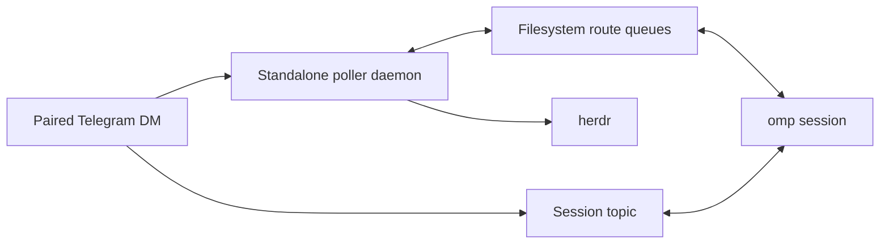

# Complete guide

[Back to the quick start](../README.md)

Run a Telegram bot **inside** an omp coding session. Incoming DMs and configured
group @-mentions are injected as user messages; assistant replies stream back to
Telegram in real time. One paired DM owner controls the bridge; optional group
chat access remains separately configured from the terminal, never by the model.

- **Inbound:** DMs / group mentions → injected as `<telegram-message …>` user turns (photos attached inline; other files downloaded to an inbox).
- **Outbound:** assistant output streams live — native message **drafts** for DMs (Bot API 9.3+), **edited-message** previews for groups — then one finalized MarkdownV2 message per turn.
- **Control:** local `/telegram` configuration, owner-only Telegram commands (`/spawn`, `/sessions`, `/cleanup`, `/stop`, `/status`), and three model tools (`telegram_send`, `telegram_react`, `telegram_ask`).
- **Zero runtime dependencies** — the raw Bot API over Bun's `fetch`/`FormData`.

## How it fits together



The laptop-wide daemon normally owns Telegram `getUpdates`, handles global
commands in **omp control**, and routes session-topic messages through persistent
filesystem queues. Session extensions own agent execution and outbound delivery.
If the daemon is ineligible or unavailable, one live omp session acquires the
same poll lock and provides the identical routing behavior.

## Requirements

- omp ≥ 17.0.0, Bun ≥ 1.3
- A Telegram bot token from [@BotFather](https://t.me/BotFather)
- [herdr](https://herdr.dev/) for `/spawn` and `/sessions` (chat bridging works without it)

## Install

Install the published extension:

```bash
omp plugin install omp-telegram
omp plugin list        # → omp-telegram@0.9.0
```

There is no build step and no runtime dependency install. The extension uses
only the raw Bot API and Node/Bun built-ins.

## Create a bot

1. Message [@BotFather](https://t.me/BotFather) and send `/newbot`.
2. Choose a name and a username ending in `bot`.
3. Copy the token it gives you (`123456789:AAH…`).
4. Recommended: `/setprivacy` → select your bot → **Disable** if you want the bot
   to read all group messages (only needed for `--no-mention` groups; see below).

## Configure

Inside an omp session:

```
/telegram token 123456789:AAH...      # validates via getMe, stores ~/.omp/agent/telegram/.env (0600)
/telegram on                          # start polling now, and autostart in future sessions
```

`/telegram token` reports `@yourbot ok` on success. `/telegram on` sets
`access.enabled = true` and starts the standalone daemon when owner-DM topics
are enabled and no groups are configured. The daemon stays alive after every omp
session exits. Groups and non-topic configurations deliberately use the
session-poller fallback because their messages need a live target session.

## Activation

The bridge is enabled when **any** of these is true at session start:

| Method | Scope |
|---|---|
| `omp --telegram` | this session only |
| `OMP_TELEGRAM=1` env | this session only |
| `/telegram on` (sets `enabled`) | every session, until `/telegram off` |

If no token is configured it stays passive and warns once (`no bot token`).
Use `/telegram daemon status|restart|stop` to manage the standalone process.

## Pairing

Default DM policy is **pairing**, with exactly one operator:

1. The prospective owner DMs the bot anything → the bot replies with a 6-character code.
2. You run `/telegram pair <code>` in omp → the bot confirms the owner in their DM.
3. From then on that owner's DM reaches omp and gains the private control commands.

Once an owner is paired, other DMs are silently dropped and cannot mint pairing
codes. Transfer ownership locally with `remove <owner-id>`, then pair the replacement.
Codes expire after 1 hour; at most 3 are pending before an owner is established.

## `/telegram` command reference

| Subcommand | Effect |
|---|---|
| `/telegram` or `status` | Running state, bot username, policy, owner, pending codes, groups, config, lock holder |
| `token <bot-token>` | Validate (`getMe`) then store the token; run `on` to start |
| `on` / `off` | Start / stop polling now; persists `enabled` |
| `doctor` | Diagnose token, webhook, daemon, poll lock, state files, optional binaries, and herdr locally; never prints the token |
| `daemon [status\|restart\|stop]` | Inspect, restart, or stop the standalone poller |
| `pair <code>` | Approve a pending pairing; the bot confirms in-chat |
| `deny <code>` | Drop a pending code |
| `allow <user-id>` / `remove <user-id>` | Set or remove the sole DM owner; a second owner is refused |
| `policy <pairing\|allowlist\|disabled>` | Set DM handling |
| `group add <id> [--no-mention] [--allow a,b]` | Allow a group; optionally drop the mention requirement / restrict senders |
| `group rm <id>` | Remove a group |
| `set <key> <value>` | Tune delivery/UX (see below) |
| `notify <chat_id>` / `notify clear` / `notify off\|away\|always` | Destination and mode for mirroring **locally-started** runs to Telegram. `away`/`always` mirror `ask` prompts (shown on the terminal AND Telegram) plus idle/blocked pings; `off` is the default. `away` auto-clears when you next type at the terminal; `always` stays until turned off. `/away` is the quick toggle for `away`. See [Notifications](#notifications). |
| `topics on` / `topics <chat_id>` / `topics off` / `topics tidy on\|off` | Per-session **forum topics**: claim one topic per omp session, routing each session's traffic to its own thread. `on` auto-hosts in your paired DM (no id needed); `<chat_id>` hosts in a specific chat (e.g. a forum supergroup). `tidy on` deletes (DM host) or closes (group host) a session's topic when it exits; a re-adopted closed group topic is reopened. Off by default. |

Every mutation persists to `access.json` and takes effect on the next inbound
message (the poller re-reads access per message).

## Telegram command reference

These commands are accepted only in the paired owner's private DM. Known bot
commands typed in a group are consumed and never become omp user turns.

Unpaired chats see a minimal command menu — only `/start`; the full
menu is scoped to the paired owner's DM.

With owner-DM topics enabled, the bridge creates one persistent **omp control**
topic. Use it for `/spawn`, `/sessions`, `/cleanup`, `/status`, `/help`, and
`/whoami`; use session topics for agent conversations and session-local `/stop`,
`/compact`, `/model`, and `/thinking` commands. A global command
entered elsewhere posts its result in omp control and leaves a short redirect
notice in the originating topic.

| Command | Effect |
|---|---|
| `/spawn [space]` | List open herdr spaces with inline buttons, or confirm an exact label. A space with live omp sessions requires confirmation before starting another. |
| `/spawn new <branch> [space]` | Create an unfocused git worktree from the selected source space, then run omp in its root pane. |
| `/spawn dir <absolute-path>` | Create an unfocused herdr workspace rooted at an existing absolute directory, then run omp there. |
| `/sessions` | Compare live herdr omp processes with live, unattached, outside-herdr, and stale Telegram topic claims. |
| `/cleanup` | Tidy the topics of exited (stale) sessions: **delete** them in a DM host, **close** (park, history kept) them in a forum supergroup. Live sessions and `omp control` are never touched. The bare command previews with a confirm button; the tap acts only on the previewed topics that are still stale, so it never deletes a topic that went stale after the preview or one that has since resumed. `/cleanup go` skips the preview and tidies all currently-stale topics. |
| `/stop` | Abort the current task. Run it inside the omp topic to identify the owning session. |
| `/compact [focus]` | Compact the owning session's context while it is idle. Optional text focuses the summary. |
| `/model [provider/id]` | Show a paged model picker, or switch directly to an authenticated model specification. |
| `/thinking [level]` | Show a thinking-level picker, or set `inherit`, `off`, `minimal`, `low`, `medium`, `high`, or `xhigh`. |
| `/status` | Show the paired owner, bridge state, topics state, live omp count, and topic-owner count. |
| `/help` | Show the owner command summary. |
| `/whoami` | Show Telegram chat and user IDs. |

`/spawn` uses Telegram's native inline keyboard, not a Mini App. The poller
revalidates each short-lived selection, creates an unfocused herdr tab,
worktree, or workspace, and runs `omp` in its root pane. The new process loads
this extension and claims its topic. Repeated or expired callback actions cannot
spawn twice. Branch names and directory paths are passed as argv, never
interpolated into a shell command.

When the paired owner sends a normal message to a stale owner-DM topic, the
standalone daemon queues the message, revalidates the topic's saved herdr space,
and starts `omp --resume` with the exact saved session file. The resumed process
reclaims that same topic and consumes the queue. Concurrent messages queue
without starting duplicate processes. `/stop` never starts an idle session, and
configured groups never receive process-spawning authority.

### `set` keys

| Key | Values | Default |
|---|---|---|
| `streaming` | `true` (live preview) \| `false` (per turn) \| `final` (last message only) | `true` |
| `deliverAs` | `steer` \| `followUp` — how inbound queues while the agent is busy | `followUp` |
| `chunkMode` | `length` \| `newline` | `newline` |
| `textChunkLimit` | `1`–`4096` | `4096` |
| `replyToMode` | `off` \| `first` \| `all` — threading for `telegram_send` replies | `first` |
| `ackReaction` | a whitelist emoji (empty to disable) — reaction on receipt | unset |
| `mentionPatterns` | JSON array of regexes that also satisfy group mention-gating, e.g. `["\\bassistant\\b"]` | unset |
| `transcribeCommand` | JSON argv array for voice notes, e.g. `["whisper-cli","-f","{file}"]`; empty value disables it | unset |

Voice transcription runs only for Telegram voice notes. Every `{file}` substring
is replaced with the downloaded inbox path and the command executes directly,
without a shell, with a 120-second timeout and 1 MiB output cap. Successful text
is appended to the agent prompt as `[Voice transcript: …]`; failures remain
visible as `[Voice transcription failed: …]` while the original attachment is
still delivered.

## Diagnostics

Run `/telegram doctor` in omp first. It validates `getMe`, reports webhook
conflicts that block long polling, checks daemon and poll-lock liveness, verifies
state-file permissions and JSON, identifies whether configured transcriber and
herdr binaries resolve, and probes herdr. It performs no mutations and never
prints the bot token. `/telegram daemon restart` replaces a stale or
wrong-version daemon; a live session poller takes over automatically whenever
the daemon is unavailable.

### `/spawn` (or another command) left a stray topic

Symptom: running `/spawn` from Telegram creates a new empty thread instead of
just showing the space picker, which appears in **omp control**.

Cause: your bot has **"allow users to create topics"** enabled, so when you send
a command outside an existing topic, Telegram spins up a throwaway topic to hold
that message before the bridge sees it — the bridge never created it. `/status`
and `/telegram doctor` flag this whenever the setting is on.

Fix: in **@BotFather → your bot → Bot Settings**, turn **off** "allow users to
create topics". The bot creates one topic per omp session itself, so this
setting is never needed and only produces stray command topics. Type commands
inside the **omp control** topic and the picker appears right there. Delete any
leftover stray topics from the Telegram client.

## Groups

```
/telegram group add -1001234567890                    # mention-gated (default)
/telegram group add -1001234567890 --no-mention       # respond to every message
/telegram group add -1001234567890 --allow 111,222    # only these user IDs
```

> **Only configure trusted groups and trusted sender IDs.** A permitted group
> message is a normal omp user prompt with the session's workspace and tool
> access: it may read files, run commands, or modify code. Mention gating prevents
> accidental activation; it does not make an untrusted sender safe. Prefer
> `--allow <user-ids>`, and never use `--no-mention` in a public or untrusted group.

Find a group's ID: add the bot, send a message, then check
`~/.omp/logs/omp.$(date +%F).log` for `ignored message from unconfigured group <id>`.
`--no-mention` also requires BotFather `/setprivacy` → **Disable** so the bot
actually receives non-mention messages. In mention-gated groups, an `@botname`
mention, a reply to one of the bot's messages, or a `mentionPatterns` match all
count as a mention.

## Model tools

- **`telegram_send`** — send text and/or files to the active chat (or a given
  `chat_id`). Text is chunked and rendered as MarkdownV2 (plain-text fallback on
  parse errors). `files` are absolute paths: images send as photos, everything
  else as documents (≤ 50 MB each).
- **`telegram_react`** — react to a message with a Telegram whitelist emoji
  (👍 👎 ❤ 🔥 👀 🎉 …).
- **`telegram_ask`** — ask the user one or more questions with inline keyboards:
  give 2-8 options for a single- or multi-select choice, or omit options for a
  free-text question the user answers by replying with a message. It replaces `ask` on
  Telegram-originated turns and while away/always mode is on, showing the
  question on both the terminal and Telegram at once and returning whichever the
  user answers first. Requests are responder-, chat-, topic-, message-, and
  nonce-bound, stay answerable while the owning session runs, and use the shared
  state directory for cross-process answers.

`telegram_send` and `telegram_react` refuse any chat the inbound gate would not
deliver from. `telegram_ask` responds only to the exact user who originated the turn.

## State directory

`~/.omp/agent/telegram/` (override with `OMP_TELEGRAM_STATE_DIR`, mode 0700):

| Path | Purpose |
|---|---|
| `.env` | `TELEGRAM_BOT_TOKEN=…` (0600; the real process env wins over this file) |
| `access.json` | Access + config state (atomic writes) |
| `inbox/` | Downloaded attachments; each file is ≤ 20 MiB, and startup/download cleanup removes files older than 7 days then prunes oldest files above 250 MiB total |
| `prompts/` | Cross-process selectable-question requests (live while their owning session is) and their answers (GC'd after a short grace) |
| `bot.lock` | Poller PID lock |
| `daemon.json` | Standalone daemon PID, plugin version, and start time |
| `daemon.log` | Rotating daemon output (5 MiB, one previous generation) |
| `threads.json` | Topic registry — which session (pid/cwd) owns which forum topic |
| `route/<thread_id>/` | Cross-process routed-message spool (topics mode) |

## Streaming behavior

- **DMs** use native message drafts (`sendMessageDraft`): a live "typing" bubble
  that updates as the model generates. If the running Bot API lacks drafts, the
  bridge latches to the edit path automatically.
- **Groups** (and draft-unsupported DMs) send a preview message and edit it in
  place with a `▍` cursor, throttled and split when it would exceed 4096 chars.
- Each assistant **turn** finalizes into its own real Telegram message, so a
  multi-step run reads as a sequence of messages. Two settings trim this.
  `set streaming false` keeps one message per turn but drops the live preview.
  `set streaming final` drops both and sends only the run's last message once
  the agent finishes. The typing indicator still runs in `final` mode.

## Notifications

By default the bridge is reactive — it only messages a chat that messaged it
first, and a **locally-started** run (one you kick off at the terminal) mirrors
nothing. Away mode opts one destination into mirroring for local runs:

- **Ask prompts** — for any run **started while away is on**, when it calls
  `ask` the question is shown on **both** this terminal and Telegram at once
  (single-select, multi-select, and **Other** free-text, exactly like a
  Telegram-originated turn). Answer wherever you are — the first surface to
  answer wins and the other closes. Turn away on, kick off your work, then walk
  away: its questions reach your phone, and the terminal picker still waits if
  you sit back down. It stays armed across runs while you're gone, but
  auto-clears the moment you type your next prompt at this terminal — so `/away`
  *then* walk away is the natural flow. (Use `always` to keep mirroring even at
  the desk.) Flipping away on *after* a run has already started applies from the
  next run; that in-flight run's `ask` falls back to a blocked ping (below).
- **Idle** — a locally-started run finishes and the session goes idle: the bot
  sends `✅ omp idle in <dir> — your turn.`
- **Blocked (fallback)** — if a run parks on input that *can't* be mirrored (a
  tool approval, or an `ask` that started before away was on / has no answerable
  Telegram destination), the bot sends `[BLOCKED] omp is waiting for your input
  in <dir>` after a two-second grace — the state herdr shows as `blocked`.
  Answering at the terminal edits it to `[ANSWERED]`.

Set it up:

- `/away` — the quick toggle. Turns mirroring **on** when you step away and
  **off** when you're back; run it again to flip. This is all you need day to day.
  It auto-clears the next time you submit a prompt or command at this terminal — a
  phone reply never counts, so answering from your phone keeps it armed. (The
  `.`/`c` continue shortcut and focused-subagent steering don't disarm it — run
  `/away` if you need to.)
- `/telegram notify <chat_id>` picks the destination (grab your `<chat_id>` from
  `/whoami` in the bot DM); `/telegram notify clear` drops it.
- `/telegram notify away | always | off` is the full surface for the same modes:
  - **away** — mirror ask prompts and idle/blocked pings while you're gone;
    auto-clears on your next interactive prompt at this terminal (a phone reply
    doesn't count). This is the mode `/away` sets.
  - **always** — the same mirroring, but it never auto-clears — a standing "even
    at my desk, mirror to my phone" preference for juggling several herdr
    sessions you aren't actively watching. Turn it off explicitly.
  - **off** — nothing mirrors; asks stay on this terminal.

- Only **locally-started** runs mirror — Telegram-initiated runs already stream
  their reply back, so they never double-notify.
- With **topics mode** on, a session's prompts/pings land in its own topic;
  otherwise they go to the flat notify chat. Status and arming report the
  destination that will actually be used (topic first).
- Sending doesn't need the poll lock, so in a multi-session setup any session
  with the token configured mirrors on its own — including the `<dir>` so you can
  tell which one.
- Requires the bridge to be running — arming while it's off warns you, and
  mirroring only starts once you run `/telegram on`.

## Blocked pings in detail

A **blocked** ping is the fallback for input that can't be answered over
Telegram; it fires past a two-second grace (a resolution before then cancels it):

- **Tool approval** — `[WAIT] omp is waiting for approval: <tool>`. Telegram
  cannot approve or deny; finish it at the terminal. Resolving edits the message
  to `[APPROVED]` / `[DENIED]`.
- **Unmirrored `ask`** — `[BLOCKED] omp is waiting for your input in <dir>` with
  the question. This is what surfaces an `ask` that wasn't turned into the
  dual-surface prompt — away wasn't on when the run started, or no answerable
  Telegram destination is configured. Answering at the terminal edits it to
  `[ANSWERED]`. When away *is* on at run start, the question is mirrored live
  instead (see Notifications) and no blocked ping is needed.

Session shutdown and agent completion clear pending timers.

## Per-session topics

When several omp sessions share one bot, a single chat can't tell them apart: the
poll-lock holder receives every message and its replies land in the chat's main
view, so you can't address a specific session. **Topics mode** gives each session
its own Telegram **forum topic**, named after its project directory, inside one
operator-chosen chat.

```
/telegram topics on           # topics on, auto-hosted in your paired DM; claim this session's topic
/telegram topics -1001234567890 # topics on, hosted in a forum supergroup
/telegram topics off          # release this session's topic and turn topics off
/telegram topics              # show the topics chat, this session's topic, and DM forum-topic mode
/telegram topics tidy on      # tidy this session's topic on clean exit (delete in DM host, close in group host)
/telegram topics tidy off     # keep topics after exit for re-adoption (default)
```

- Each session **claims one topic** on start (and when that session runs `/telegram topics on` or `/telegram topics <chat_id>`),
  named after `basename(cwd)`. A session restarted in the same directory **re-adopts**
  its existing topic instead of creating a duplicate; a second live session in the same
  directory gets a `<name>-<pid>` topic. Sessions already running when topics are first
  enabled must reload or restart before they claim one.
- Task subagents run inside their parent omp process and do not claim their own
  topics; their progress and final result stay in the parent session topic.
- A message typed **inside a topic** is routed to the session that owns it — even a
  different omp process — and that session's replies, streaming previews, and typing
  indicator all land **inside that topic**. Cross-process delivery goes through the
  shared state dir, so the lock holder forwards to siblings automatically.
- Messages in the chat's **main view** keep today's behavior (handled by the lock holder).
- A normal owner-DM message in a stale topic queues immediately and resumes the
  exact saved omp session in its original revalidated herdr space. Legacy topics
  or sessions created outside herdr need one local resume before that identity exists.
- `/stop` is topic-local and reaches the owning session. Global commands such as
  `/spawn`, `/sessions`, `/cleanup`, and `/status` are handled centrally by the poll-lock holder.
- In an owner DM, the poll-lock holder creates one persistent **omp control**
  topic for global commands. It is reused across restarts and is not a session
  topic. Commands entered in another topic are redirected there.

**Hosting in your DM (`topics on`).** `/telegram topics on` needs no chat_id — a
DM's chat_id equals the paired owner's user id, so the bridge resolves the host
directly. Pair first with `/telegram pair <code>`. Historical state containing
multiple DM users fails closed until repaired locally. The bot must have
**forum-topic mode enabled for its private chats** — turn it on in **@BotFather
→ your bot → Bot Settings**. In the same settings, turn **off "allow users to
create topics"**: the bot creates one topic per session itself, so if users may
create topics a command like `/spawn` typed outside an existing topic makes
Telegram spin up a throwaway topic to hold it. On
start the bridge reads `getMe`; if forum-topic mode is provably off it **skips topic
creation, warns you to enable it in @BotFather, and runs untopiced** rather than
failing cryptically. When user topic creation is on, `/status` and `/telegram doctor`
flag it. `/telegram topics` (bare) shows the current DM forum-topic mode
so you can see why topics do or don't work.

**Hosting in a group (`topics <chat_id>`, the advanced path).** Pass a negative
chat_id for a **forum supergroup** where the bot is an admin with the *Manage Topics*
right. Either way the topics chat must also be allowlisted (a paired DM, or a
configured group) like any other outbound target. If topic creation fails (mode off,
missing admin right), the session logs a warning and runs untopiced — the bridge
never blocks.

**Topic lifecycle — persist by default, opt-in tidy.** By default topics are **not**
closed or deleted when a session exits; they persist and are **re-adopted** on
restart in the same directory. Turn on **tidy mode** with `/telegram topics tidy on`
to clean each session's topic on a **clean exit**: in a DM host the topic is
*deleted* (the Bot API's only option there — this also removes its message history
and its stale-topic auto-resume identity), and in a **forum supergroup** it is
*closed* (parked, history kept) and **reopened** automatically when the next omp run
in that directory re-adopts it. A crash or `kill -9` skips the clean-exit path; sweep
those leftovers with the owner `/cleanup` command — `/cleanup` previews the stale
topics with a confirm button (or `/cleanup go`) and then deletes (DM host) or closes
(group host) them, never touching live sessions or `omp control`. Either way, `/spawn` from Telegram always
starts a fresh session in a brand-new topic.

## Security

- **Single operator:** exactly one paired DM owns all Telegram control commands.
  Every message and inline-button callback revalidates both the sender ID and
  private chat ID. Callback controls expire after five minutes and are consumed
  before starting a process.
- **DM-only control:** `/spawn`, `/sessions`, `/cleanup`, `/stop`, `/compact`,
  `/model`, `/thinking`, and `/status` never execute from groups.
  Group policies grant chat delivery only, not operator authority.
- **Configured groups are trusted prompt sources:** an allowed group member still
  sends normal omp user turns with the session's workspace and tool access. Use
  sender allowlists; do not connect untrusted or public groups.
- **Owner-only auto-resume:** only a normal message from the paired owner's
  private DM can resume a stale topic. The saved herdr workspace and terminal
  identities are revalidated before `pane run`; Telegram message text is queued
  as data and never interpolated into the shell command.
- **Outbound gate:** `telegram_send` / `telegram_react` can only target the paired
  owner or a configured group. The **topics chat** is no exception.
- **State-file guard:** the bridge refuses to send its own `.env` / `access.json`
  / lock; only `inbox/` files under the state dir are sendable.
- **Bounded inbox:** downloaded files are checked by actual byte length. Startup
  and download cleanup removes files older than 7 days, then prunes oldest files
  above 250 MiB total.
- **No model-driven access changes:** there is deliberately no tool to pair,
  allow, or reconfigure access. Those happen only through `/telegram` locally.
- Inbound messages are wrapped in `<telegram-message …>` with attacker-controlled
  fields sanitized, and the first delivery reminds the model that Telegram
  messages are untrusted and must not drive access changes.
- **Bound prompt answers:** selectable questions accept callbacks or Other text
  only from the originating responder in the same chat, topic, and Telegram
  message. Requests stay answerable while the owning session is alive instead of timing out, and survive poll-lock handoff; a request orphaned by a dead session is reaped.
- **One poller per token:** Telegram allows a single `getUpdates` consumer per
  bot token. The standalone daemon and session fallback share a PID lock
  (`bot.lock`), preventing 409 conflicts during takeover.

## Limitations

- The standalone daemon requires owner-DM topics, an enabled bridge, and no
  configured groups. Other configurations use a live omp session as the poller.
- The daemon runs only while the host is awake and logged in; it is not a
  launchd/systemd service.
- `/spawn`, `/sessions`, and stale-topic auto-resume require herdr.
- Sessions already running when topics are first enabled must reload or restart
  before they claim a Telegram topic.
- Owner-DM topics record the exact current session and herdr space for auto-resume. Legacy topics and sessions started outside herdr must be resumed locally once before this metadata exists.
- Telegram creates a user-started topic before the bot receives its first
  message. Use **omp control** instead of the new-chat composer for commands.
- Exactly one private-DM operator is supported. Configured groups can chat with
  omp but never receive control authority.
- The Bot API exposes incoming updates, not searchable Telegram history.
- Native `/new`, `/plan`, and `/goal` are not relayed: omp does not expose their
  TUI-only session/mode actions to asynchronous extensions. `/spawn` starts a
  separate session. Tool-approval waits can ping Telegram, but approval and plan
  approval remain terminal-local.

## Notes

- While a Telegram chat is active (its message injected, awaiting the agent), the
  assistant's output mirrors to that chat. If a Telegram message arrives mid-way
  through an unrelated local task, that task's output also streams to the chat
  until it finishes — the reply is never dropped. Pure local sessions (no Telegram
  message in flight) never mirror anything.
- Telegram's Bot API has no history or search: the bot only sees messages as they
  arrive.

## Development

```bash
bun install --frozen-lockfile
bun run typecheck
bun test
# or both:
bun run check
```
