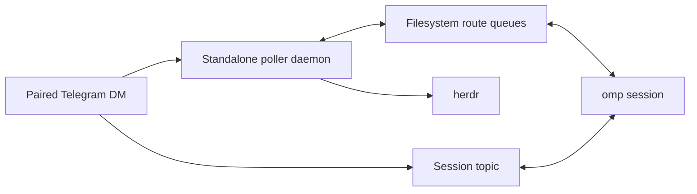

# Complete guide

[Back to the quick start](../README.md)

Run a Telegram bot inside an omp coding session. Incoming DMs and configured
group mentions become user messages, and assistant replies stream back to
Telegram. One paired DM owner controls the bridge. Group access is configured
separately from the terminal and grants no control authority.

- Inbound messages arrive as `<telegram-message …>` user turns. Photos are
  attached inline, and other files are downloaded to an inbox.
- A failed or uncertain inbound delivery always gets a visible notice. By
  default a delivered message also gets 👀, then 👍 once a reply lands.
  `deliveryStatus all` adds a progress reply for every message.
- Outbound assistant text uses native message drafts in DMs on Bot API 9.3 or
  newer, with edited previews in groups. Automatic final replies use a durable
  outbox.
- Local `/telegram` configuration, owner Telegram commands, and the
  `telegram_send`, `telegram_react`, and `telegram_ask` tools make up the control
  surface.
- The extension has no runtime dependencies. It calls the raw Bot API through
  Bun's `fetch` and `FormData`.

## How it fits together


```mermaid
flowchart LR
  TG[Paired Telegram DM] --> D[Standalone poller daemon]
  TG --> T1[Session topic]
  D --> H[herdr]
  D <--> Q[Filesystem route queues]
  Q <--> O1[omp session]
  T1 <--> O1
```

The laptop-wide daemon normally owns Telegram `getUpdates`, handles global
commands in **omp control**, and routes session-topic messages through persistent
filesystem queues. Session extensions own agent execution and outbound delivery.
If the daemon is ineligible or unavailable, one live omp session acquires the
same poll lock and provides the identical routing behavior.

## Requirements

- omp ≥ 18.1.16, Bun ≥ 1.3
- A Telegram bot token from [@BotFather](https://t.me/BotFather)
- [herdr](https://herdr.dev/) for `/spawn` and `/sessions` (chat bridging works without it)

## Install

Install the published extension:

```bash
omp plugin install omp-telegram
omp plugin list        # → omp-telegram@0.13.0
```

There is no build step and no runtime dependency install. The extension uses
only the raw Bot API and Node/Bun built-ins.

## Create a bot

1. Message [@BotFather](https://t.me/BotFather) and send `/newbot`.
2. Choose a name and a username ending in `bot`.
3. Copy the token it gives you (`123456789:AAH…`).
4. Recommended: `/setprivacy` → select your bot → **Disable** if you want the bot
   to read all group messages (only needed for `--no-mention` groups; see below).

## Configure

The guided path runs in an interactive omp terminal:

```
/telegram setup
```

It validates the configured token or prompts for a new one, enables the bridge,
walks through owner pairing, offers session topics when the bot reports support,
and runs the full diagnostics at the end.

For manual setup, run:

```
/telegram token 123456789:AAH...      # validates via getMe, stores ~/.omp/agent/telegram/.env (0600)
/telegram on                          # start polling now, and autostart in future sessions
```

`/telegram token` reports `@yourbot ok` on success. `/telegram on` sets
`access.enabled = true` and starts the standalone daemon when owner-DM topics
are enabled and no groups are configured. The daemon stays alive after every omp
session exits. Groups and non-topic configurations use the session poller
fallback because their messages need a live target session.

## Activation

The bridge is enabled when **any** of these is true at session start:

| Method | Scope |
|---|---|
| `omp --telegram` | this session only |
| `OMP_TELEGRAM=1` env | this session only |
| `/telegram on` (sets `enabled`) | every session, until `/telegram off` |

If no token is configured it stays passive and warns once (`no bot token`).
Use `/telegram daemon status|restart|stop` to manage the standalone process.

## Untopiced private DMs

Topic messages still use their topic ID and session claim. Only private messages
without a topic use the persisted **DM-owner session**.

The first enabled omp session claims DM ownership. A resumed session reclaims
ownership when its session file matches the saved record. If the saved owner is
not running, the bot refuses the message and tells you how to resume or replace
the owner.

- Run `/telegram own` to pin the current session.
- Run `/telegram own status` to show the saved session and process state.
- Run `/telegram own clear` to remove the pin.

Set `OMP_TELEGRAM_DM_OWNER=1` in a fleet or conductor session to force its claim
at each start. This variable does not enable the bridge.

## Pairing

Default DM policy is **pairing**, with exactly one operator:

1. The prospective owner DMs the bot anything → the bot replies with a 6-character code.
2. You run `/telegram pair <code>` in omp → the bot confirms the owner in their DM.
3. From then on that owner's DM reaches omp and gains the private control commands.

Once an owner is paired, other DMs are silently dropped and cannot mint pairing
codes. Transfer ownership locally with `remove <owner-id>`, then pair the replacement.
Codes expire after 1 hour; at most 3 are pending before an owner is established.

Approval checks the expiry again while holding the access-state lock. An expired
code is removed and refused even if it was visible when the command was entered.

`/telegram policy disabled` applies to private DMs. It refuses private messages,
owner commands, pending DM prompt answers, and private callback buttons.
Configured groups continue to use their own sender and mention policy, including
answers to prompts created in those groups.

## `/telegram` command reference

| Subcommand | Effect |
|---|---|
| `/telegram` or `status` | Running state, bot username, policy, owner, pending codes, groups, config, lock holder |
| `token <bot-token>` | Validate (`getMe`) then store the token; run `on` to start |
| `setup` | Run guided local token, pairing, topics, and diagnostic setup in an interactive terminal |
| `on` / `off` | Start / stop polling now; persists `enabled` |
| `doctor` | Diagnose token, webhook, daemon, poll lock, state files, optional binaries, and herdr locally; never prints the token |
| `daemon [status\|restart\|stop]` | Inspect, restart, or stop the standalone poller |
| `retry [<chat_id> [thread_id] [uncertain]]` | List retained undelivered replies, or retry one exact chat and topic. Add `uncertain` only after checking the chat because it may duplicate a message. |
| `own [status\|clear]` | Pin the current session for private DMs without a topic, show the pin, or remove it |
| `pair <code>` | Approve a pending pairing; the bot confirms in-chat |
| `deny <code>` | Drop a pending code |
| `allow <user-id>` / `remove <user-id>` | Set or remove the sole paired Telegram account; a second account is refused |
| `policy <pairing\|allowlist\|disabled>` | Set private-DM handling. `disabled` leaves configured groups active. |
| `group add <id> [--no-mention] [--allow a,b]` | Allow a group; optionally drop the mention requirement / restrict senders |
| `group rm <id>` | Remove a group |
| `set <key> <value>` | Tune delivery/UX (see below) |
| `notify <chat_id>` / `notify clear` / `notify off\|away\|always` | Destination and mode for mirroring **locally-started** runs to Telegram. `away`/`always` mirror `ask` prompts (shown on the terminal AND Telegram) plus idle/blocked pings; `off` is the default. `away` auto-clears when you next type at the terminal; `always` stays until turned off. `/away` is the quick toggle for `away`. See [Notifications](#notifications). |
| `topics on` / `topics <chat_id>` / `topics off` / `topics tidy on\|off` | Per-session **forum topics**: claim one topic per omp session, routing each session's traffic to its own thread. `on` auto-hosts in your paired DM (no id needed); `<chat_id>` hosts in a specific chat (e.g. a forum supergroup). `tidy on` deletes (DM host) or closes (group host) a session's topic when it exits; a re-adopted closed group topic is reopened. Off by default. |

Every access mutation reloads and writes `access.json` under a process-shared
lock. The poller reads the current access policy for each message.

## Telegram command reference

Owner actions execute only in the paired owner's private DM. `/start` and
`/help` still provide pairing help before an owner exists, and `/whoami` reports
the caller's IDs. Known bot commands typed in a group are consumed and never
become omp user turns. Unpaired chats see only `/start` in the command menu. The
full menu is scoped to the paired owner's DM.

With owner-DM topics enabled, the bridge creates one persistent **omp control**
topic. Use it for `/spawn`, `/sessions`, `/cleanup`, `/status`, `/help`, and
`/whoami`. Session topics accept `/session`, `/stop`, `/compact`, `/model`,
`/thinking`, and `/retry`. A global command entered elsewhere posts its result
in omp control and leaves a short redirect notice in the originating topic.

| Command | Effect |
|---|---|
| `/spawn [space]` | List open herdr spaces with inline buttons, or confirm an exact label. A space with live omp sessions requires confirmation before starting another. |
| `/spawn new <branch> [space]` | Create an unfocused git worktree from the selected source space, then run omp in its root pane. |
| `/spawn dir <absolute-path>` | Create an unfocused herdr workspace rooted at an existing absolute directory, then run omp there. |
| `/sessions` | Compare live herdr omp processes with Telegram topic claims. Sessions with a live bridge status have a button that opens a session card. |
| `/session` | Open the card for the one live omp session attached to this topic. |
| `/cleanup` | Tidy the topics of exited (stale) sessions: **delete** them in a DM host, **close** (park, history kept) them in a forum supergroup. Live sessions and `omp control` are never touched. The bare command previews with a confirm button; the tap acts only on the previewed topics that are still stale, so it never deletes a topic that went stale after the preview or one that has since resumed. `/cleanup go` skips the preview and tidies all currently-stale topics. |
| `/stop` | Abort the current task. Run it inside the omp topic to identify the owning session. |
| `/compact [focus]` | Compact the owning session's context while it is idle. Optional text focuses the summary. |
| `/model [provider/id]` | Show a paged model picker, or switch directly to an authenticated model specification. |
| `/thinking [level]` | Show a thinking-level picker, or set `inherit`, `off`, `minimal`, `low`, `medium`, `high`, or `xhigh`. |
| `/retry [uncertain]` | Retry failed automatic reply parts for this owner's DM session topic. `uncertain` includes parts Telegram may already have accepted. |
| `/status` | Show the paired owner, bridge state, topics state, live omp count, and topic-owner count. |
| `/help` | Show the owner command summary. |
| `/whoami` | Show Telegram chat and user IDs. |

A session card shows the session state, ID, directory, model, thinking level,
context use, pending-message state, and last activity. Refresh updates the card.
Stop, Model, Thinking, and Compact route the matching session command to the
exact live process and topic.

Only the paired owner can open or use a card. Every button press reloads access
state and checks the card message, owner, process, session ID, chat, topic, and
current route before it dispatches. A card for a group-hosted session remains an
owner control in the owner's private DM. The configured group itself gains
no command or callback authority.

`/spawn` uses Telegram's native inline keyboard, not a Mini App. The poller
revalidates each short-lived selection, creates an unfocused herdr tab,
worktree, or workspace, and runs `omp` in its root pane. The new process loads
this extension and claims its topic. Repeated or expired callback actions cannot
spawn twice. Branch names and directory paths are passed as argv, never
interpolated into a shell command.

When the paired owner sends a normal message to a stale owner-DM topic, the
standalone daemon queues the message, revalidates the topic's saved herdr space,
and starts `omp --resume` with the exact saved session file. The resumed process
reclaims that same topic and consumes the queue. Concurrent messages queue
without starting duplicate processes. `/stop` never starts an idle session, and
configured groups never receive process-spawning authority.

### `set` keys

| Key | Values | Default |
|---|---|---|
| `streaming` | `true` (live preview) \| `false` (per turn) \| `final` (last message only) \| `explicit` (nothing automatic) | `true` |
| `richMessages` | `off` (MarkdownV2) \| `auto` (rich constructs) \| `on` (prefer rich Markdown) | `off` |
| `profile` | `daemon` (headless host: forces `explicit`, no idle notify post, `telegram_ask` always on) \| `default` | `default` |
| `deliverAs` | `steer` \| `followUp` — how inbound queues while the agent is busy | `followUp` |
| `chunkMode` | `length` \| `newline` | `newline` |
| `textChunkLimit` | `1`–`4096`; also caps rich source when explicitly set | unset (4096 legacy; 32768 whole rich) |
| `replyToMode` | `off` \| `first` \| `all` — threading for `telegram_send` replies | `first` |
| `ackReaction` | a whitelist emoji (empty to disable) — reaction on receipt | unset |
| `deliveryStatus` | `reactions` (👀 when omp accepts, 👍 once a reply lands) \| `failures` (notices only for failed or uncertain delivery) \| `all` (a received, queued, delivered status reply) | `reactions`, or `failures` when `ackReaction` is set |
| `mentionPatterns` | JSON array of regexes that also satisfy group mention-gating, e.g. `["\\bassistant\\b"]` | unset |
| `transcribeCommand` | JSON argv array for voice notes, e.g. `["whisper-cli","-f","{file}"]`; empty value disables it | unset |

Voice transcription runs only for Telegram voice notes. Every `{file}` substring
is replaced with the downloaded inbox path and the command executes directly,
without a shell, with a 120-second timeout and 1 MiB output cap. Successful text
is appended to the agent prompt as `[Voice transcript: …]`; failures remain
visible as `[Voice transcription failed: …]` while the original attachment is
still delivered.

### Inbound replies and attachments

When a Telegram message replies to another message, the bridge includes the
earlier text or caption as quoted, untrusted context in the omp request. The
quote is capped at 4096 characters.

Photo albums with one media group ID are collected during the inbound batching
window and submitted as one omp request. Each photo remains a separate image
block. Ordinary text messages from the same conversation may also share a
batch.

If an attachment is too large, cannot be downloaded, or cannot be transcribed,
the bridge posts a visible reply to that Telegram message. Usable text or a
caption still reaches omp. A message with no usable text or attachment ends in
`failed`, and that failure notice names the attachment problem.

While a free-text `telegram_ask` question is pending, an authorized voice-note
reply is transcribed with `transcribeCommand` and used as the answer. A failed
transcription leaves the question open and asks the user to send text.

## Diagnostics

Run `/telegram doctor` in omp first. It validates `getMe`, reports webhook
conflicts that block long polling, checks daemon and poll-lock liveness, verifies
state-file permissions and JSON, identifies whether configured transcriber and
herdr binaries resolve, and probes herdr. It performs no mutations and never
prints the bot token. `/telegram daemon restart` replaces a stale or
wrong-version daemon; a live session poller takes over automatically whenever
the daemon is unavailable.

The poll lock stores the PID, a random per-process nonce, and the session
identity. Its mtime is a heartbeat that updates every 15 seconds. The nonce
prevents a different process with the same numeric PID from re-entering,
refreshing, or releasing the lock. A contender cannot reclaim a lock with a
heartbeat younger than 45 seconds, even when its PID probe fails.

If Telegram returns a `409` polling conflict, the losing poller stops its
heartbeat and releases its lock. If the lock record identifies a different live
owner, a session poller reports that owner. Then the poller waits before it retries.

### `/spawn` (or another command) left a stray topic

Symptom: running `/spawn` from Telegram creates a new empty thread instead of
just showing the space picker, which appears in **omp control**.

Cause: your bot has **"allow users to create topics"** enabled, so when you send
a command outside an existing topic, Telegram spins up a throwaway topic to hold
that message before the bridge sees it — the bridge never created it. `/status`
and `/telegram doctor` flag this whenever the setting is on.

Fix: in **@BotFather → your bot → Bot Settings**, turn **off** "allow users to
create topics". The bot creates one topic per omp session itself, so this
setting is never needed and only produces stray command topics. Type commands
inside the **omp control** topic and the picker appears right there. Delete any
leftover stray topics from the Telegram client.

## Groups

```
/telegram group add -1001234567890                    # mention-gated (default)
/telegram group add -1001234567890 --no-mention       # respond to every message
/telegram group add -1001234567890 --allow 111,222    # only these user IDs
```

> **Only configure trusted groups and trusted sender IDs.** A permitted group
> message is a normal omp user prompt with the session's workspace and tool
> access: it may read files, run commands, or modify code. Mention gating prevents
> accidental activation; it does not make an untrusted sender safe. Prefer
> `--allow <user-ids>`, and never use `--no-mention` in a public or untrusted group.

Find a group's ID: add the bot, send a message, then check
`~/.omp/logs/omp.$(date +%F).log` for `ignored message from unconfigured group <id>`.
`--no-mention` also requires BotFather `/setprivacy` → **Disable** so the bot
actually receives non-mention messages. In mention-gated groups, an `@botname`
mention, a reply to one of the bot's messages, or a `mentionPatterns` match all
count as a mention.

## Model tools

- **`telegram_send`** — send text and/or files to the active or durably claimed
  chat (or a given `chat_id`). Markdown follows `richMessages`, with MarkdownV2
  as the default and plain-text fallback on parse errors. `format: "text"` stays
  literal in every mode. `files` are absolute paths: images send
  as photos, everything else as documents (≤ 50 MB each).
- **`telegram_react`** — react to a message with a Telegram whitelist emoji
  (👍 👎 ❤ 🔥 👀 🎉 …).
- **`telegram_ask`** — ask the user one or more questions with inline keyboards:
  give 2-8 options for a single- or multi-select choice, or omit options for a
  free-text question the user answers by replying with a message. It replaces
  `ask` on Telegram-originated turns and while away/always mode is on, showing
  the question on both the terminal and Telegram at once and returning whichever
  the user answers first. Otherwise it stays mounted alongside `ask` whenever
  the bridge is running with a paired owner, so a locally injected turn (a
  scheduled tick or extension-composed prompt) can still reach Telegram.
  Requests are responder-, chat-, topic-, message-, and
  nonce-bound, stay answerable while the owning session runs, and use the shared
  state directory for cross-process answers.
  Every result starts with an `Ask provenance` JSON record. `posted` lists only
  surfaces that successfully received the question, `answeredBy` names the
  accepted answer's origin, and `errors` preserves per-surface posting failures. A
  terminal answer therefore cannot hide a failed Telegram post: the result
  includes a `SURFACE ERROR [telegram]` line alongside the answer.

When a tool target is omitted, the bridge resolves it in this order: the active
inbound conversation, this process's session topic, an exact durable
`sessionFile`/`sessionId` topic claim, then an exact-session DM-owner claim.
Explicit arguments always win. A claim for another session is ignored rather
than widening delivery to the main chat; with no safe target, the tool fails
closed.

`telegram_send` and `telegram_react` refuse any chat the inbound gate would not
deliver from. `telegram_ask` responds only to the exact user who originated the turn.

## State directory

`~/.omp/agent/telegram/` (override with `OMP_TELEGRAM_STATE_DIR`, mode 0700):

| Path | Purpose |
|---|---|
| `.env` | `TELEGRAM_BOT_TOKEN=…` (0600; the real process env wins over this file) |
| `access.json` | Access + config state (atomic writes) |
| `inbox/` | Downloaded attachments; each file is ≤ 20 MiB, and startup/download cleanup removes files older than 7 days then prunes oldest files above 250 MiB total |
| `prompts/` | Cross-process selectable-question requests (live while their owning session is) and their answers (GC'd after a short grace) |
| `bot.lock` | Poller PID, random process nonce, owner identity, and heartbeat mtime |
| `dm-owner.json` | Session that receives private DMs without a topic |
| `daemon.json` | Standalone daemon PID, plugin version, and start time |
| `daemon.log` | Rotating daemon output (5 MiB, one previous generation) |
| `threads.json` | Topic registry — which session (pid/cwd) owns which forum topic |
| `route/<thread_id>.accepted.json` / `route/dm.accepted.json` | Bounded identities for accepted routed messages, used to suppress duplicate delivery |
| `route/<thread_id>/` / `route/dm/` | Durable routed envelopes for topics and untopiced private DMs |
| `route/<thread_id>/last-inbound.json` / `route/dm/last-inbound.json` | Receipt for the most recent inbound handoff on the route |
| `outbox/` | Up to 50 recently updated automatic final-reply records, with per-part confirmation and retry state |
| `session-status/` / `session-cards/` | Live session snapshots and owner-authorized card bindings |

### Durable inbound routing and delivery states

With `deliveryStatus all`, each normal inbound message gets one small Telegram
status reply that the bridge edits in place as the delivery state changes. By
default only `failed` and `uncertain` create that reply:

- `received` means the bridge accepted the Bot API update.
- `queued` means the bridge started the exact session-route handoff.
- `accepted` means the session submitted the user turn to omp. It makes no claim
  about whether an agent has replied.
- `failed` means the bridge could not complete the handoff. The status includes
  a short reason when one is available.
- `uncertain` means the consumer stopped while the handoff was in flight. The
  turn may already have reached omp, so the bridge does not retry it
  automatically.

A message inside the configured topics chat follows its exact topic route. The
bridge does not give it to the poll-lock holder's local session when the claim is
missing, dead, or changes during delivery. A stale owner-DM topic can use its
separate authorized auto-resume path.

For a live cross-process route, `writeRouted` stores a routed envelope with the
Telegram message, a stable delivery identity, state, attempts, and claim owner.
An active envelope or an accepted-ledger entry suppresses another copy of the
same original message. Telegram edits have revision-specific identities and can
be delivered separately.
The route watcher claims the envelope, marks it `inflight`, writes the inbound
receipt, and waits for the receiving session's delivery promise. Only a resolved
consumer promise records the identity as accepted in the dedup ledger and
removes the envelope. A rejected submission is retried up to three attempts. If
the consumer process exits after the `inflight` write, the envelope becomes
`uncertain` and stays for diagnosis. Automatic retry at that point could
duplicate an omp user turn.

The bounded `last-inbound.json` receipt is written immediately before the
session handoff:

```json
{
  "messageId": 12345,
  "date": 1700000000,
  "fromId": 555,
  "chatId": 100,
  "messageThreadId": 7,
  "textSha256": "9f86d081…",
  "receivedAt": 1700000000123
}
```

- It is written before handoff so a supervisor can see the message a stopped
  consumer attempted to accept.
- It stores a hash instead of message text. A supervisor that sent a challenge
  can hash its own copy without reading an agent transcript.
- Each route has one receipt that is replaced in place and removed with the
  other route state.
- The bridge writes it with mode `0600` inside the `0700` route directory,
  using a temporary file and rename.

This file is a stable contract for external supervisors.

## Streaming behavior

- **DMs** use native message drafts (`sendMessageDraft`): a live "typing" bubble
  that updates as the model generates. If the running Bot API lacks drafts, the
  bridge latches to the edit path automatically.
- **Groups** (and draft-unsupported DMs) send a preview message and edit it in
  place with a `▍` cursor, throttled and split when it would exceed 4096 chars.
- Each assistant **turn** finalizes into its own real Telegram message, so a
  multi-step run reads as a sequence of messages. Three settings trim this.
  `set streaming false` keeps one message per turn but drops the live preview.
  `set streaming final` drops both and sends only the run's last message once
  the agent finishes. `set streaming explicit` sends **nothing** on its own: text
  reaches Telegram only when the model calls `telegram_send` or `telegram_ask`.
  The typing indicator still runs in `final` and `explicit` modes.
- `explicit` is deliberately silent rather than best-effort. It has no
  end-of-run fallback, because the run most likely to lack an explicit send is
  one a message steered into mid-task, where the last visible text is that
  task's closing line and not an answer to anyone. A missing reply is visible to
  the person waiting and can be asked again; a leaked internal turn cannot be
  recalled. Ask for an answer, not a transcript.
- Legacy messages split at 4096 characters (or `textChunkLimit`), with room
  reserved for formatting and labels. Splits prefer paragraph, line, or word
  boundaries (`chunkMode`). Each part carries `(i/n)`; code fences close and
  reopen across splits. Command output keeps this limit, with keyboards on the
  final part.
- `set richMessages auto` selects rich Markdown for tables, task lists,
  `<details>`, paired `$$` math, and `<tg-emoji>` outside code. Headings alone
  don't select it. `on` prefers rich Markdown for all Markdown output; `off`
  keeps MarkdownV2. Rich messages require Bot API 10.1+.
- Rich delivery sends the original Markdown, including Telegram's native task
  syntax. Telegram controls rendering and checkbox interaction. This setting
  adds no checklist-management commands or state store.
- Live drafts and edit previews stay unchanged. Final messages and final
  preview edits use the selected format. An answer with no permanent preview or
  committed prefix can arrive as one rich message up to 32768 UTF-16 source
  units when `textChunkLimit` is unset. An explicit cap remains authoritative.
  Longer answers and existing previews keep legacy chunk boundaries.
- A definitive rich rejection (400 or unsupported-method 404) falls back to
  MarkdownV2, then plain text on a parse rejection. A rejected whole answer is
  split again to fit legacy limits. Network failures, timeouts, server errors,
  authorization failures, and exhausted rate limits don't trigger another-format
  send. Constructs split across parts may lose formatting.
- A part Telegram rate-limits (`429`) is retried up to three times, honouring
  `retry_after`, instead of dropping the rest of the answer.

### Outbound outbox and recovery

Before an automatic final reply is sent or edited, the bridge writes all of its
parts to the outbox. It saves each part as `pending`, `inflight`, `sent`,
`failed`, or `uncertain` before and after remote attempts. Confirmed parts are
skipped on recovery, and the record is removed after every part is sent. The
outbox keeps the 50 most recently updated records.

A normal retry sends failed parts and leaves uncertain parts alone. An uncertain
part has no confirmed result and may already be visible in Telegram. Resend it
only after checking the chat. `/retry uncertain` makes that choice explicit.

In an owner's DM session topic, `/retry` targets that exact chat and topic. A
group-hosted session cannot accept an owner command from the group, so its
retained reply is recovered from the omp terminal with
`/telegram retry <chat_id> [thread_id] [uncertain]`. The terminal notification
for an undelivered reply prints the matching command.

## Headless hosts (`profile daemon`)

A host nobody is sitting at — a scheduler, a fleet orchestrator, anything whose
runs are cron ticks rather than someone typing — wants the opposite defaults from
a laptop. `/telegram set profile daemon` switches all of them at once:

- **Output becomes explicit.** Forces `streaming: explicit`, so no live preview
  and no per-turn message. Only `telegram_send` / `telegram_ask` reach the chat.
  This is what stops a multi-step answer arriving as five messages, and stops a
  message that lands mid-task from relaying the rest of that task's internal
  turns.
- **No idle post.** The end-of-run notification is suppressed, so a tick's
  closing text stays on the host.
- **`telegram_ask` is always mounted and aimed at the paired owner** — including
  on a locally injected tick, which has no terminal to fall back to. Without
  this, a scheduled turn that needed a decision found `ask` (which nobody can
  answer) or no ask tool at all.

It is one key rather than three so a host cannot end up half-configured, and it
wins over a `streaming` value left in the file from before. `/telegram status`
reports the mode actually in force plus the profile. Approval and blocked-input
pings are unaffected: those mean something needs a human, which is the whole
point of the bridge on a host like this.

## Notifications

By default the bridge is reactive — it only messages a chat that messaged it
first, and a **locally-started** run (one you kick off at the terminal) mirrors
nothing. Away mode opts one destination into mirroring for local runs:

- **Ask prompts** — for any run **started while away is on**, when it calls
  `ask` the question is shown on **both** this terminal and Telegram at once
  (single-select, multi-select, and **Other** free-text, exactly like a
  Telegram-originated turn). Answer wherever you are — the first surface to
  answer wins and the other closes. Turn away on, kick off your work, then walk
  away: its questions reach your phone, and the terminal picker still waits if
  you sit back down. It stays armed across runs while you're gone, but
  auto-clears the moment you type your next prompt at this terminal — so `/away`
  *then* walk away is the natural flow. (Use `always` to keep mirroring even at
  the desk.) Flipping away on *after* a run has already started applies from the
  next run; that in-flight run's `ask` falls back to a blocked ping (below).
- **Idle** — a locally-started run finishes and the session goes idle: the bot
  sends the run's final text, or `✅ omp idle in <dir> — your turn.` when it had
  none. This is the one notification `set profile daemon` (and any `explicit`
  streaming mode) turns off: on a host whose runs are scheduled ticks it relays
  every run's closing prose, which is internal working text rather than anything
  addressed to you. Ask prompts and blocked pings still fire — those are
  "something needs you", not narration.
- **Blocked (fallback)** — if a run parks on input that *can't* be mirrored (a
  tool approval, or an `ask` that started before away was on / has no answerable
  Telegram destination), the bot sends `[BLOCKED] omp is waiting for your input
  in <dir>` after a two-second grace — the state herdr shows as `blocked`.
  Answering at the terminal edits it to `[ANSWERED]`.

Set it up:

- `/away` — the quick toggle. Turns mirroring **on** when you step away and
  **off** when you're back; run it again to flip. This is all you need day to day.
  It auto-clears the next time you submit a prompt or command at this terminal — a
  phone reply never counts, so answering from your phone keeps it armed. (The
  `.`/`c` continue shortcut and focused-subagent steering don't disarm it — run
  `/away` if you need to.)
- `/telegram notify <chat_id>` picks the destination (grab your `<chat_id>` from
  `/whoami` in the bot DM); `/telegram notify clear` drops it.
- `/telegram notify away | always | off` is the full surface for the same modes:
  - **away** — mirror ask prompts and idle/blocked pings while you're gone;
    auto-clears on your next interactive prompt at this terminal (a phone reply
    doesn't count). This is the mode `/away` sets.
  - **always** — the same mirroring, but it never auto-clears — a standing "even
    at my desk, mirror to my phone" preference for juggling several herdr
    sessions you aren't actively watching. Turn it off explicitly.
  - **off** — nothing mirrors; asks stay on this terminal.

- **Run failures** — a Telegram-initiated run that fails at the provider (quota exhausted, 429, etc.) no longer dies silently: the first scheduled retry, the model fallback switch, and the terminal failure (with a hint at `/model` and `/sessions`) land in the same topic the reply would have used. A recovered retry reports back too. `explicit` streaming mode opts out, like it does for all automatic egress.
- Only **locally-started** runs mirror — Telegram-initiated runs already stream
  their reply back, so they never double-notify.
- With **topics mode** on, a session's prompts/pings land in its own topic;
  otherwise they go to the flat notify chat. Status and arming report the
  destination that will actually be used (topic first).
- Sending doesn't need the poll lock, so in a multi-session setup any session
  with the token configured mirrors on its own — including the `<dir>` so you can
  tell which one.
- Requires the bridge to be running — arming while it's off warns you, and
  mirroring only starts once you run `/telegram on`.

## Blocked pings in detail

A **blocked** ping is the fallback for input that can't be answered over
Telegram; it fires past a two-second grace (a resolution before then cancels it):

- **Tool approval** — `[WAIT] omp is waiting for approval: <tool>`. Telegram
  cannot approve or deny; finish it at the terminal. Resolving edits the message
  to `[APPROVED]` / `[DENIED]`.
- **Unmirrored `ask`** — `[BLOCKED] omp is waiting for your input in <dir>` with
  the question. This is what surfaces an `ask` that wasn't turned into the
  dual-surface prompt — away wasn't on when the run started, or no answerable
  Telegram destination is configured. Answering at the terminal edits it to
  `[ANSWERED]`. When away *is* on at run start, the question is mirrored live
  instead (see Notifications) and no blocked ping is needed.

Session shutdown and agent completion clear pending timers.

## Per-session topics

When several omp sessions share one bot, a single chat can't tell them apart: the
poll-lock holder receives every message and its replies land in the chat's main
view, so you can't address a specific session. **Topics mode** gives each session
its own Telegram **forum topic**, named after the pane herdr knows it by (falling
back to its project directory), inside one operator-chosen chat.

```
/telegram topics on           # topics on, auto-hosted in your paired DM; claim this session's topic
/telegram topics -1001234567890 # topics on, hosted in a forum supergroup
/telegram topics off          # release this session's topic and turn topics off
/telegram topics              # show the topics chat, this session's topic, and DM forum-topic mode
/telegram topics tidy on      # tidy this session's topic on clean exit (delete in DM host, close in group host)
/telegram topics tidy off     # keep topics after exit for re-adoption (default)
```

- Each session **claims one topic** on start (and when that session runs `/telegram topics on` or `/telegram topics <chat_id>`).
  The title is the strongest identity available, in this order: the pane's **herdr agent
  name** (what you assigned with `herdr agent start <name>` or `agent rename`, one-to-one
  with the session), then the pane's **herdr space label**, then `basename(cwd)`.
  The space is consulted because the agent lookup is best-effort — it reads herdr over a
  socket and returns nothing on failure — and because `topics tidy on` re-derives the
  title on every restart rather than once. On a host where several panes share one parent
  directory, that combination is what used to title every topic after the shared
  directory. Outside herdr, `basename(cwd)` is all there is. A session
  restarted in the same directory **re-adopts**
  its existing topic instead of creating a duplicate; a second live session in the same
  directory gets a `<name>-<pid>` topic. Sessions already running when topics are first
  enabled must reload or restart before they claim one.
- Task subagents run inside their parent omp process and do not claim their own
  topics; their progress and final result stay in the parent session topic.
- A message inside a configured topic follows the route claimed by that topic.
  The bridge durably queues cross-process handoff and waits for the owning
  session to acknowledge submission. Missing, dead, or changed ownership never
  falls back to the poll-lock holder's local omp session.
- Messages in the chat's main view are untopiced and use the ordinary
  lock-holder flow.
- A normal owner-DM message in a stale topic queues immediately and resumes the
  exact saved omp session in its original revalidated herdr space. Other
  unowned topics return an explicit notice. Legacy topics or sessions created
  outside herdr need one local resume before their identity exists.
- `/stop` is topic-local and reaches the owning session. Global commands such as
  `/spawn`, `/sessions`, `/cleanup`, and `/status` are handled centrally by the poll-lock holder.
- In an owner DM, the poll-lock holder creates one persistent **omp control**
  topic for global commands. It is reused across restarts and is not a session
  topic. Commands entered in another topic are redirected there.

**Hosting in your DM (`topics on`).** `/telegram topics on` needs no chat_id — a
DM's chat_id equals the paired owner's user id, so the bridge resolves the host
directly. Pair first with `/telegram pair <code>`. Historical state containing
multiple DM users fails closed until repaired locally. The bot must have
**forum-topic mode enabled for its private chats** — turn it on in **@BotFather
→ your bot → Bot Settings**. In the same settings, turn **off "allow users to
create topics"**: the bot creates one topic per session itself, so if users may
create topics a command like `/spawn` typed outside an existing topic makes
Telegram spin up a throwaway topic to hold it. On
start the bridge reads `getMe`; if forum-topic mode is provably off it **skips topic
creation, warns you to enable it in @BotFather, and runs untopiced** rather than
failing cryptically. When user topic creation is on, `/status` and `/telegram doctor`
flag it. `/telegram topics` (bare) shows the current DM forum-topic mode
so you can see why topics do or don't work.

**Hosting in a group (`topics <chat_id>`, the advanced path).** Pass a negative
chat_id for a **forum supergroup** where the bot is an admin with the *Manage Topics*
right. Either way the topics chat must also be allowlisted (a paired DM, or a
configured group) like any other outbound target. If topic creation fails (mode off,
missing admin right), the session logs a warning and runs untopiced — the bridge
never blocks.

**Topic lifecycle — persist by default, opt-in tidy.** By default topics are **not**
closed or deleted when a session exits; they persist and are **re-adopted** on
restart in the same directory. Turn on **tidy mode** with `/telegram topics tidy on`
to clean each session's topic on a **clean exit**: in a DM host the topic is
*deleted* (the Bot API's only option there — this also removes its message history
and its stale-topic auto-resume identity), and in a **forum supergroup** it is
*closed* (parked, history kept) and **reopened** automatically when the next omp run
in that directory re-adopts it. A crash or `kill -9` skips the clean-exit path; sweep
those leftovers with the owner `/cleanup` command — `/cleanup` previews the stale
topics with a confirm button (or `/cleanup go`) and then deletes (DM host) or closes
(group host) them, never touching live sessions or `omp control`. Either way, `/spawn` from Telegram always
starts a fresh session in a brand-new topic.

## Security

- Exactly one paired DM owns Telegram control commands. Every command and
  callback checks the current owner and private chat before it acts.
- Spawn, cleanup, and session-list pickers expire after five minutes. A session
  card stays bound to its exact process, session ID, chat, topic, and message
  while that session is live. Each action rechecks those bindings at the bridge
  and again in the receiving session.
- `/spawn`, `/sessions`, `/cleanup`, `/session`, `/stop`, `/compact`, `/model`,
  `/thinking`, `/retry`, and `/status` do not execute from ordinary group
  messages. Group policy grants prompt delivery and prompt-answer authority
  without granting operator control.
- **Configured groups are trusted prompt sources:** an allowed group member still
  sends normal omp user turns with the session's workspace and tool access. Use
  sender allowlists; do not connect untrusted or public groups.
- **Owner-only auto-resume:** only a normal message from the paired owner's
  private DM can resume a stale topic. The saved herdr workspace and terminal
  identities are revalidated before `pane run`; Telegram message text is queued
  as data and never interpolated into the shell command.
- **Outbound gate:** `telegram_send` / `telegram_react` can only target the paired
  owner or a configured group. The **topics chat** is no exception.
- **State-file guard:** the bridge refuses to send its own `.env` / `access.json`
  / lock; only `inbox/` files under the state dir are sendable.
- **Bounded inbox:** downloaded files are checked by actual byte length. Startup
  and download cleanup removes files older than 7 days, then prunes oldest files
  above 250 MiB total.
- **No model-driven access changes:** there is deliberately no tool to pair,
  allow, or reconfigure access. Those happen only through `/telegram` locally.
- Inbound messages are wrapped in `<telegram-message …>` with attacker-controlled
  fields sanitized, and the first delivery reminds the model that Telegram
  messages are untrusted and must not drive access changes.
- **Bound prompt answers:** selectable questions accept callbacks or Other text
  only from the originating responder in the same chat, topic, and Telegram
  message. Requests stay answerable while the owning session is alive instead of timing out, and survive poll-lock handoff; a request orphaned by a dead session is reaped.
- **One poller per token:** Telegram allows a single `getUpdates` consumer per
  bot token. The standalone daemon and session fallback share a PID lock
  (`bot.lock`), preventing 409 conflicts during takeover.

## Limitations

- The standalone daemon requires owner-DM topics, an enabled bridge, and no
  configured groups. Other configurations use a live omp session as the poller.
- The daemon runs only while the host is awake and logged in; it is not a
  launchd/systemd service.
- `/spawn`, `/sessions`, and stale-topic auto-resume require herdr.
- Sessions already running when topics are first enabled must reload or restart
  before they claim a Telegram topic.
- Owner-DM topics record the exact current session and herdr space for auto-resume. Legacy topics and sessions started outside herdr must be resumed locally once before this metadata exists.
- Telegram creates a user-started topic before the bot receives its first
  message. Use **omp control** instead of the new-chat composer for commands.
- Exactly one private-DM operator is supported. Configured groups can chat with
  omp but never receive control authority.
- The Bot API exposes incoming updates, not searchable Telegram history.
- Native `/new`, `/plan`, and `/goal` are not relayed: omp does not expose their
  TUI-only session/mode actions to asynchronous extensions. `/spawn` starts a
  separate session. Tool-approval waits can ping Telegram, but approval and plan
  approval remain terminal-local.

## Notes

- While a Telegram chat is active (its message injected, awaiting the agent), the
  assistant's output mirrors to that chat. If a Telegram message arrives mid-way
  through an unrelated local task, that task's output also streams to the chat
  until it finishes — the reply is never dropped. Pure local sessions (no Telegram
  message in flight) never mirror anything.
- Telegram's Bot API has no history or search: the bot only sees messages as they
  arrive.

## Development

```bash
bun install --frozen-lockfile
bun run check
bun run check:host -- 18.1.16
bun run check:host -- latest
bun run smoke:package
```

The locked install and `bun run check` cover the repository dependency graph.
`check:host` packs the extension, typechecks it against the requested omp host,
and loads the packed registrar. Run it against the supported minimum and
`latest`. `smoke:package` checks the tarball contents and loads that artifact
without network access. CI runs all three checks, and the release workflow also
uses a frozen install and the package smoke before publishing.
